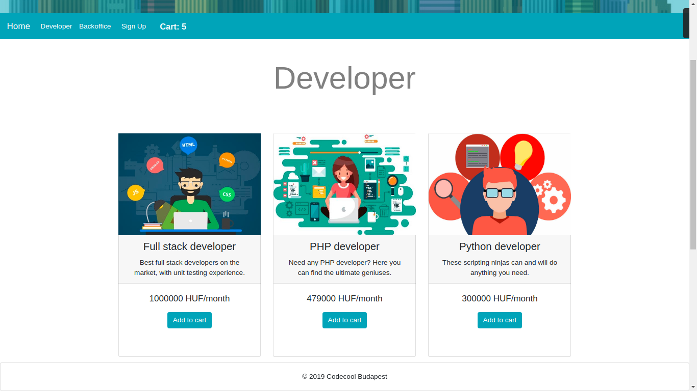
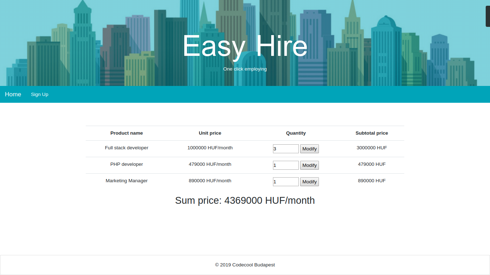
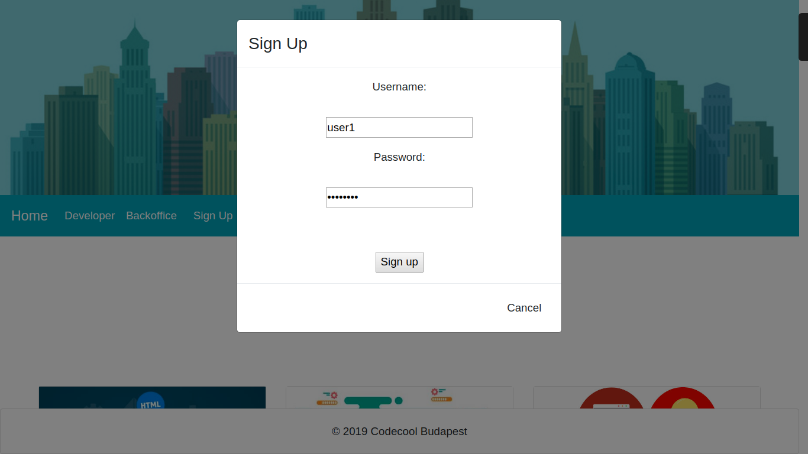

# EasyHire - One Click Employing

(Part of) a webshop where you can hire all your employees with one click.

A 3-week Codecool team project for practicing web technologies and DAO pattern with Java SE.

# Features
* Listing employees in database by categories
* Add employees to cart
* Review cart, see sum price
* Modify amount of employees in cart
* Display amount of employees in cart in header
* User can sign up, user name with hashed password is stored in the database

# Future plans
* Log in
* Store cart data in session, handle multiple users
* Implement current stock in database, only limited amount available
* Checkout with payment and email confirmation

# Used technologies

## Back-end:
* Servlets with Jetty
* JDBC with PostgreSQL database
* Project Lombok for code simplification
* Spring Security's BCrypt for password hashing

## Front-end:
* JavaScript
* HTML with Thymeleaf templating engine
* CSS with Bootstrap

# How to run

jetty:run
